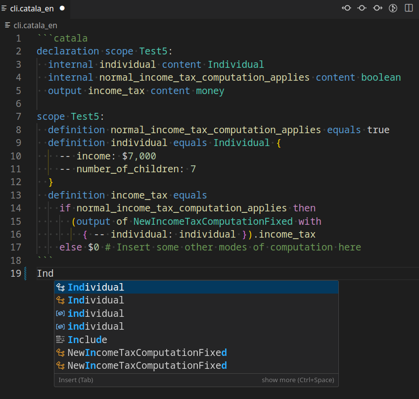
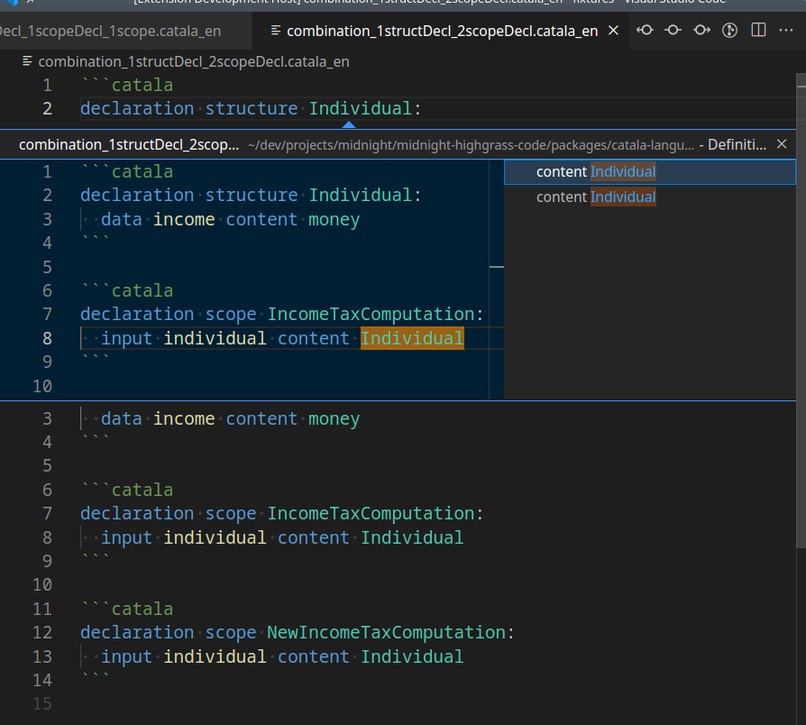
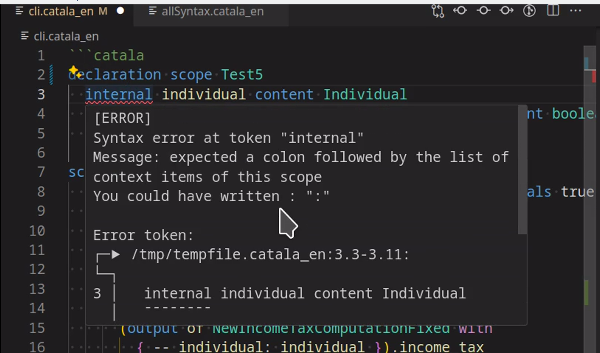
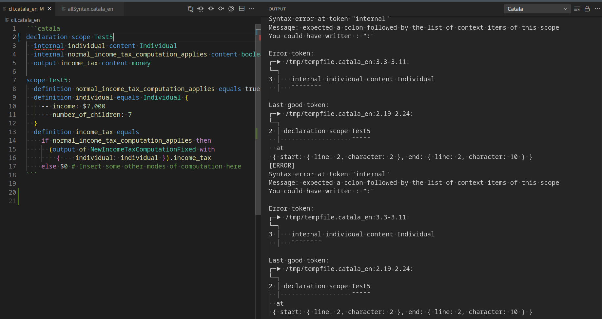

# Demo

## Completions


## Definitions


## Diagnostics



# Command line

tree-sitter parse ./server/src/catala/tree-sitter ./home/user/dev/projects/midnight/midnight-highgrass-code/packages/catala-test-app/test.catala_en
tree-sitter parse /home/user/dev/projects/midnight/midnight-highgrass-code/packages/catala-test-app/test.catala_en

# Research

## Syntax highlighting in the Catalang repo
How does syntax highlighting work in the official repo?

Note: All files are from the repo root

1. Makefile
```bash
vscode_en: ${CURDIR}/syntax_highlighting/en/setup_vscode.sh
	chmod +x $<
	$<
```

2. syntax_highlighting/en/setup_vscode.sh
```bash
ln -s -f $SCRIPTPATH/vscode "$FILE"
```

3. syntax_highlighting/en/vscode
Copy whole folder into local vscode folder at
~/.vscode/extensions/catala-en

## Vscode extension
- Syntax Highlight Guide
  - Semantic Highlight Guide

- run yo locally
npx --package yo --package generator-code -- yo code

- textmate
https://macromates.com/manual/en/language_grammars

## Tests

### Errors

#### Solution
Add `--reset`
```bash
clerk test tutorial_en/tests/test_tutorial.catala_en --reset
```

#### Trace
clerk test tests/priorities.catala_en
[ERROR] Unexpected error: Not_found

### File content
```catala
declaration scope A:
  output w content integer
  output x content integer
  output y content integer
  output z content decimal

scope A:
  definition w equals 4 - 2 - 2
  definition x equals 4 - (2 - 2)
  definition y equals 4 - 2 - -2
  definition z equals 200 / 2 * 4. - 50. / - (5. - 20 / 2)
```

```catala-test-inline
$ catala Typecheck --check-invariants
[RESULT] All invariant checks passed
[RESULT] Typechecking successful!
```

```catala-test-inline
$ catala test-scope A
[RESULT] Computation successful! Results:
[RESULT] w = 0
[RESULT] x = 4
[RESULT] y = 4
[RESULT] z = 390.0
```

# Development

## Prerequisites
1. For the "Setup" part, understand how to build tree-sitter grammars for local usage
    (https://tree-sitter.github.io/tree-sitter/)
    1. And and to use the grammar in your code
        (https://github.com/tree-sitter/node-tree-sitter)
2. For the "Run" part, understand how to run a VSCode extension locally
    (https://code.visualstudio.com/api/language-extensions/language-server-extension-guide)

## Setup
1. Clone https://github.com/AltGr/tree-sitter-catala
    1. npm i
    2. npm run build
    3. /bindings dir gets created
    4. copy path  "path/to/tree-sitter-catala/bindings/node/index.js"
2. Go to file `server/src/catala/parser.ts`
    1. Paste (1.4) to import path in `import * as Catala from '<here>'`

## Run
1. Go to "Run and Debug" in the VSCode sidebar (invoked by command "View: Show Run and Debug")
2. Choose "Launch Client" and click on the play button
3. A new VSCode window should open with the extension running
    - you can press CTRL+R to reload the extension window to apply changes


# TODOs

### Get syntax highlighting to work
- [ ] vscode extension
